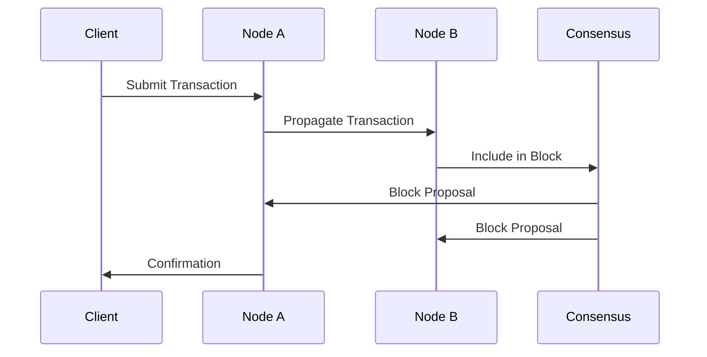

# Architecture Overview

SpaceJam Network is built with a modular architecture that prioritizes scalability, security, and interoperability. This document provides a comprehensive overview of the system's design and core components.

## Core Components

### 1. Network Layer

The network layer handles peer discovery, message propagation, and connection management:

```rust
pub struct NetworkConfig {
    pub listen_addr: String,
    pub bootstrap_nodes: Vec<String>,
    pub max_peers: usize,
    pub heartbeat_interval: Duration,
}

pub trait NetworkBehavior {
    fn handle_message(&mut self, peer_id: PeerId, message: Message);
    fn broadcast(&mut self, message: Message);
    fn direct_send(&mut self, peer_id: PeerId, message: Message);
}
```

### 2. Consensus Engine

The consensus engine implements our hybrid proof-of-stake mechanism:

```rust
pub struct ConsensusConfig {
    pub block_time: Duration,
    pub validators: Vec<Validator>,
    pub threshold: u64,
}

pub trait ConsensusEngine {
    fn propose_block(&mut self) -> Block;
    fn validate_block(&self, block: &Block) -> Result<(), Error>;
    fn finalize_block(&mut self, block: Block);
}
```

### 3. Storage Layer

Our storage layer provides efficient state management and data persistence:

```rust
pub trait Storage {
    fn get(&self, key: &[u8]) -> Option<Vec<u8>>;
    fn put(&mut self, key: &[u8], value: Vec<u8>);
    fn delete(&mut self, key: &[u8]);
    fn batch_write(&mut self, operations: Vec<StorageOp>);
}
```

## System Design

### Message Flow



### State Management

SpaceJam Network uses a hybrid state management approach:

1. **In-Memory State**: For fast access to frequently used data
2. **Persistent Storage**: For long-term data retention
3. **State Merkle Tree**: For efficient state verification

### Security Model

Our security model is built on three pillars:

1. **Cryptographic Primitives**

   - Ed25519 for signatures
   - Blake3 for hashing
   - ChaCha20-Poly1305 for encryption

2. **Network Security**

   - TLS 1.3 for all connections
   - Peer authentication
   - Rate limiting and DoS protection

3. **Consensus Security**
   - Byzantine fault tolerance
   - Stake-weighted voting
   - Slashing conditions

## Performance Optimizations

1. **Parallel Transaction Processing**

   - Multi-threaded execution
   - WASM runtime optimization
   - Custom memory allocator

2. **Network Optimizations**

   - Dynamic peer selection
   - Gossip protocol optimization
   - Message batching

3. **Storage Optimizations**
   - LRU caching
   - Compaction strategies
   - Pruning policies

## Future Developments

1. **Layer 2 Solutions**

   - State channels
   - Rollups
   - Plasma chains

2. **Cross-Chain Integration**

   - Bridge protocols
   - Asset transfers
   - Message passing

3. **Developer Tools**
   - SDK improvements
   - Testing frameworks
   - Monitoring solutions

## References

- [Network Protocol Specification](/docs/specs/network)
- [Consensus Algorithm Details](/docs/specs/consensus)
- [Storage Format Specification](/docs/specs/storage)
